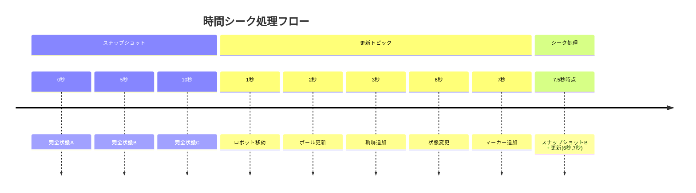

# 時間軸対応機能

## 🎯 概要

時間軸対応機能は、Foxglove Studioの時間シーク操作に完全対応し、任意の時点での正確な可視化状態を再現する機能です。複数トピック統合システムと連携して、スナップショットと更新データから指定時刻の状態を動的に合成します。

## ⏰ 時間シーク機能の仕組み

### 基本原理

1. **時刻変更検出**: Foxglove Studioの`currentTime`監視
2. **基準点検索**: 指定時刻以前の最新スナップショット
3. **更新適用**: スナップショット以降の増分更新を時系列順に適用
4. **状態合成**: 最終的な可視化状態を構築



## 🔄 双方向時間シーク対応

### 順方向シーク（通常再生）
通常の時間進行に従って状態を更新
```typescript
// 時刻7.5秒にシーク
const targetTime = 7500; // ミリ秒
const composedState = composeMessagesAtTime(targetTime);
```

### 逆方向シーク（巻き戻し）
過去の時点への移動でも正確な状態復元
```typescript
// 時刻3.2秒に巻き戻し
const targetTime = 3200; // ミリ秒
// スナップショット0秒 + 更新(1秒,2秒,3秒)を合成
const composedState = composeMessagesAtTime(targetTime);
```

### ジャンプシーク（任意時点への移動）
タイムライン上の任意の点への瞬間移動
```typescript
// 時刻50分32.5秒へジャンプ
const targetTime = (50 * 60 + 32) * 1000 + 500;
const composedState = composeMessagesAtTime(targetTime);
```

### スナップショット不在時のフォールバック
スナップショット（/aggregated_svgs）が履歴内に存在しない場合でも、更新トピック（/visualizer_svgs）のみから仮状態を構築します。

- 適用方針: `replace` と `clear` のみを時系列に適用し、`append` は無視
- ねらい: `replace` を自己完結（レイヤー全体の完全置換）とすることで、ベース不在でも意味のある表示を維持
- 効果: 長距離巻き戻しやスナップショット欠損時の視覚破綻を回避

```typescript
// aggregated が見つからない場合の合成（概念）
const updates = getUpdatesInRange(-Infinity, targetTime).sort((a, b) => a.time - b.time);
const layerMap = new Map<string, string[]>();
for (const u of updates) {
  switch (u.operation) {
    case 'replace': layerMap.set(u.layer, [...u.svg_primitives]); break;
    case 'clear':   layerMap.set(u.layer, []); break;
    case 'append':  /* ベース不在では無視 */ break;
  }
}
return buildFinalState(layerMap); // 空なら undefined
```

## 🏗️ 実装アーキテクチャ

### 時間管理システム

#### 時刻検出機構
```typescript
// Foxglove Studioからの時刻変更を監視
context.onRender = (renderState, done) => {
  if (renderState.currentTime !== undefined) {
    const newCurrentTime = renderState.currentTime.sec * 1000 + 
                          renderState.currentTime.nsec / 1000000;
    setSeekTime(newCurrentTime);
  }
};

context.watch("currentTime");
```

#### 状態合成エンジン
```typescript
const composeMessagesAtTime = useCallback((targetTime: number): SvgLayerArray | undefined => {
  try {
    // 1. 基準スナップショットの検索
    const baseSnapshot = findLatestSnapshotBefore(targetTime);
    if (!baseSnapshot) return undefined;
    
    // 2. レイヤー状態の初期化
    const layerMap = initializeLayerMap(baseSnapshot);
    
    // 3. 関連する更新の抽出と適用
    const updates = extractRelevantUpdates(baseSnapshot.timestamp, targetTime);
    applyUpdatesInOrder(layerMap, updates);
    
    // 4. 最終状態の構築
    return buildFinalState(layerMap);
  } catch (error) {
    console.error('Time seek composition error:', error);
    return undefined;
  }
}, [aggregatedMessages, updateMessages, config.enableUpdateTopic]);
```

### メッセージ履歴管理

#### タイムスタンプベース索引
```typescript
// 効率的な時間ベース検索のためのMap構造
const aggregatedMessages = new Map<number, MessageEvent>();
const updateMessages = new Map<number, MessageEvent>();

// メッセージ受信時のタイムスタンプ計算
const timestamp = message.receiveTime.sec * 1000 + message.receiveTime.nsec / 1000000;
```

#### 履歴検索アルゴリズム
```typescript
const findLatestSnapshotBefore = (targetTime: number) => {
  let latestTime = -1;
  let latestSnapshot: SvgLayerArray | undefined;
  
  for (const [timestamp, message] of aggregatedMessages) {
    if (timestamp <= targetTime && timestamp > latestTime) {
      latestTime = timestamp;
      latestSnapshot = message.message as SvgLayerArray;
    }
  }
  
  return { snapshot: latestSnapshot, timestamp: latestTime };
};
```

## 📊 パフォーマンス最適化

### 効率的な状態合成

#### レイヤーマップ最適化
```typescript
// 初期化時の効率的なコピー
const layerMap = new Map<string, string[]>();
baseSnapshot.svg_primitive_arrays.forEach(array => {
  if (array?.layer && Array.isArray(array.svg_primitives)) {
    layerMap.set(array.layer, [...array.svg_primitives]);
  }
});
```

#### 更新処理の最適化
```typescript
// 操作別の効率的な処理
switch (update.operation) {
  case "replace":
    // 完全置換（最も効率的）
    layerMap.set(update.layer, [...update.svg_primitives]);
    break;
    
  case "append":
    // 追加処理（既存配列との結合）
    const existing = layerMap.get(update.layer) || [];
    layerMap.set(update.layer, [...existing, ...update.svg_primitives]);
    break;
    
  case "clear":
    // クリア処理（空配列設定）
    layerMap.set(update.layer, []);
    break;
}
```

### メモリ効率化

#### 自動履歴管理
```typescript
// 設定可能な履歴制限
const config = {
  maxHistoryDuration: 300, // 5分間
  maxHistorySize: 1000     // 最大1000メッセージ
};

// 定期的なクリーンアップ（30秒間隔）
useEffect(() => {
  const interval = setInterval(cleanupHistory, 30000);
  return () => clearInterval(interval);
}, [cleanupHistory]);
```

#### スマートキャッシング
```typescript
// 最後に合成した状態をキャッシュ
const [lastComposedTime, setLastComposedTime] = useState<number>();
const [lastComposedState, setLastComposedState] = useState<SvgLayerArray>();

// 同じ時刻への重複シークを回避
if (targetTime === lastComposedTime && lastComposedState) {
  return lastComposedState;
}
```

## 🎛️ ユーザーインターフェース

### 時間情報表示
```typescript
// パネル上での時間情報表示
{seekTime !== undefined && (
  <p>Seek Time: {new Date(seekTime).toISOString()}</p>
)}
```

### 履歴状況監視
```typescript
// リアルタイム履歴サイズ表示
<p>History: Aggregated({aggregatedMessages.size}), Updates({updateMessages.size})</p>
```

### デバッグ情報
```typescript
// 開発時の詳細情報表示
if (process.env.NODE_ENV === 'development') {
  console.log(`Composing state for time: ${targetTime}`);
  console.log(`Base snapshot at: ${baseSnapshotTime}`);
  console.log(`Applying ${relevantUpdates.length} updates`);
}
```

## 🚀 高度な活用例

### 精密分析モード
```typescript
// ミリ秒単位での精密な時間分析
const precisionSeek = (targetTimeMs: number) => {
  const composedState = composeMessagesAtTime(targetTimeMs);
  
  // 特定レイヤーの詳細分析
  const robotLayer = composedState?.svg_primitive_arrays
    .find(layer => layer.layer.startsWith('robots/'));
  
  if (robotLayer) {
    analyzeRobotPositions(robotLayer.svg_primitives);
  }
};
```

### 比較分析
```typescript
// 複数時点の状態比較
const compareTimePoints = (time1: number, time2: number) => {
  const state1 = composeMessagesAtTime(time1);
  const state2 = composeMessagesAtTime(time2);
  
  return {
    differences: findStateDifferences(state1, state2),
    movements: calculateMovements(state1, state2),
    timeline: time2 - time1
  };
};
```

### パフォーマンス分析
```typescript
// 時間シーク性能の監視
const measureSeekPerformance = (targetTime: number) => {
  const startTime = performance.now();
  const result = composeMessagesAtTime(targetTime);
  const endTime = performance.now();
  
  console.log(`Seek to ${targetTime}ms took ${endTime - startTime}ms`);
  return result;
};
```

## 💡 ベストプラクティス

### 効率的な時間移動
1. **段階的移動**: 大きな時間ジャンプより小刻みな移動
2. **キーフレーム活用**: スナップショット時刻への移動を優先
3. **履歴制限調整**: 分析期間に応じた適切な設定

### データ設計の推奨事項
1. **適切なスナップショット間隔**: 3-10秒（データ量とのバランス）
2. **レイヤー分割**: 更新頻度に応じたレイヤー設計
3. **更新最適化**: 不要な更新の削減

### デバッグとトラブルシューティング
1. **ログ出力**: 重要な時間イベントのログ記録
2. **状態検証**: 合成結果の妥当性確認
3. **パフォーマンス監視**: 処理時間の定期的な測定

この時間軸対応機能により、Foxglove Studioでの詳細な時系列分析と効率的なデバッグワークフローを実現しています。
